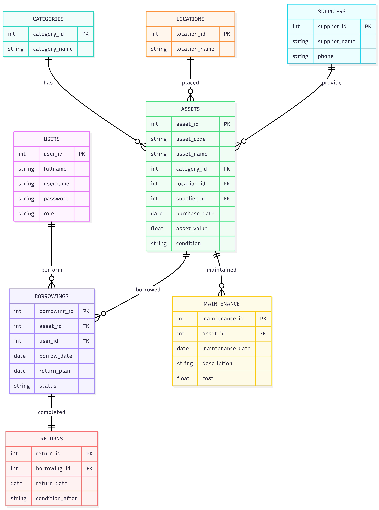

# PERANCANGAN SISTEM MANAJEMEN SARANA DAN PRASARANA

## Milestone 1 - Perencanaan Menu dan UI Wireframing

### Mata Kuliah

UI/UX dan Front-End Development

### Judul Proyek

Sistem Manajemen Sarana dan Prasarana (Asset Management System)

### Tema Desain

Neumorphism Admin Dashboard

---

# 1. Deskripsi Sistem

Sistem Manajemen Sarana dan Prasarana merupakan aplikasi berbasis web yang digunakan untuk membantu pengelolaan aset organisasi secara terintegrasi. Sistem ini dirancang untuk memudahkan administrator dalam melakukan pendataan aset, pemantauan kondisi aset, pencatatan peminjaman dan pengembalian, serta penyusunan laporan inventaris.

Konsep desain yang digunakan adalah Neumorphism dengan tampilan modern, bersih, profesional, dan mudah digunakan.

---

# 2. Tujuan Sistem

Tujuan pembangunan sistem ini adalah:

1. Mengelola data aset secara terpusat.
2. Mempermudah proses pencatatan inventaris.
3. Memantau kondisi aset secara real-time.
4. Mengelola proses peminjaman dan pengembalian aset.
5. Menyediakan laporan inventaris yang informatif.
6. Meningkatkan efisiensi administrasi sarana dan prasarana.

---

# 3. Hak Akses Pengguna

## Administrator

Memiliki akses penuh terhadap seluruh fitur sistem.

Hak akses:

* Mengelola data aset
* Mengelola kategori aset
* Mengelola lokasi aset
* Mengelola supplier
* Mengelola pengguna
* Mengelola transaksi
* Mengakses seluruh laporan

## Petugas Inventaris

Hak akses:

* Mengelola data aset
* Mengelola transaksi peminjaman
* Mengelola transaksi pengembalian
* Mengelola maintenance aset
* Mengakses laporan

## Pimpinan

Hak akses:

* Melihat dashboard
* Melihat laporan
* Melihat statistik aset

---

# 4. Struktur Menu Sistem

## Sidebar Menu

Dashboard

Data Master

* Data Aset
* Kategori Aset
* Lokasi
* Supplier
* Data Pengguna

Transaksi

* Peminjaman Aset
* Pengembalian Aset
* Maintenance Aset

Monitoring

* Kondisi Aset
* Aset Rusak
* Aset Hilang

Laporan

* Laporan Inventaris
* Laporan Peminjaman
* Laporan Pengembalian
* Laporan Maintenance

Pengaturan

* Profil Sistem
* Hak Akses
* Backup Data

Logout

---

# 5. Struktur Navbar

Navbar terdiri dari:

* Logo Sistem
* Search Asset
* Notifikasi
* User Profile
* Dropdown Menu

---

# 6. User Flow Sistem

## User Flow Pendataan Aset

Login
→ Dashboard
→ Data Master
→ Data Aset
→ Tambah Aset
→ Isi Form
→ Simpan
→ Data Berhasil Disimpan

---

## User Flow Peminjaman

Login
→ Dashboard
→ Peminjaman Aset
→ Tambah Peminjaman
→ Pilih Aset
→ Input Data Peminjam
→ Simpan
→ Status Dipinjam

---

## User Flow Pengembalian

Login
→ Dashboard
→ Pengembalian Aset
→ Cari Data Peminjaman
→ Input Kondisi Aset
→ Simpan
→ Status Kembali

---

# 7. Kebutuhan Halaman Sistem

## Halaman Dashboard

Menampilkan:

* Total Aset
* Total Peminjaman
* Total Maintenance
* Total Aset Rusak
* Grafik Inventaris
* Grafik Kondisi Aset
* Aktivitas Terbaru

## Halaman Data Master

Menampilkan:

* Data Tabel
* Search
* Filter
* Pagination
* Tombol Tambah
* Tombol Edit
* Tombol Hapus

## Halaman Form

Menampilkan:

* Form Input Data
* Validasi Form
* Tombol Simpan
* Tombol Batal

## Halaman Laporan

Menampilkan:

* Ringkasan Data
* Statistik
* Cetak Laporan
* Export PDF

---

# 8. Perancangan Database

Entitas yang digunakan:

1. Users
2. Assets
3. Categories
4. Locations
5. Suppliers
6. Borrowings
7. Returns
8. Maintenance

---

# 9. Entity Relationship Diagram (ERD)

erDiagram
    USERS {
        int user_id PK
        string fullname
        string username
        string password
        string role
    }

    CATEGORIES {
        int category_id PK
        string category_name
    }

    LOCATIONS {
        int location_id PK
        string location_name
    }

    SUPPLIERS {
        int supplier_id PK
        string supplier_name
        string phone
    }

    ASSETS {
        int asset_id PK
        string asset_code
        string asset_name
        int category_id FK
        int location_id FK
        int supplier_id FK
        date purchase_date
        float asset_value
        string condition
    }

    BORROWINGS {
        int borrowing_id PK
        int asset_id FK
        int user_id FK
        date borrow_date
        date return_plan
        string status
    }

    RETURNS {
        int return_id PK
        int borrowing_id FK
        date return_date
        string condition_after
    }

    MAINTENANCE {
        int maintenance_id PK
        int asset_id FK
        date maintenance_date
        string description
        float cost
    }

    CATEGORIES ||--o{ ASSETS : has
    LOCATIONS ||--o{ ASSETS : placed
    SUPPLIERS ||--o{ ASSETS : provide

    ASSETS ||--o{ BORROWINGS : borrowed
    USERS ||--o{ BORROWINGS : perform

    BORROWINGS ||--|| RETURNS : completed

    ASSETS ||--o{ MAINTENANCE : maintained
	

---

# 10. Konsep User Interface

Tema yang digunakan adalah Neumorphism.

Karakteristik desain:

* Soft Shadow
* Rounded Corner
* Floating Card
* Clean Interface
* Minimalist Layout
* Professional Dashboard

---

# 11. Design System

## Color Palette

Primary Color
#5E81F4

Secondary Color
#7B61FF

Success
#4CAF50

Warning
#FFC107

Danger
#F44336

Background
#E6EAF0

Card Surface
#EEF2F7

Text Primary
#2D3436

Text Secondary
#636E72

---

## Typography

Font Family:
Poppins

Heading 1:
32px Bold

Heading 2:
24px SemiBold

Heading 3:
20px SemiBold

Body:
16px Regular

Caption:
14px Regular

---

# 12. Komponen Reusable

Button:

* Primary Button
* Secondary Button
* Success Button
* Danger Button

Form:

* Text Input
* Number Input
* Text Area
* Dropdown
* Date Picker

Card:

* Summary Card
* Asset Card
* Report Card

Table:

* Data Table
* Pagination
* Search
* Filter

Modal:

* Add Modal
* Edit Modal
* Delete Confirmation Modal

---

# 13. Wireframe Dashboard

Komponen utama:

* Sidebar Navigation
* Navbar
* Ringkasan Statistik
* Grafik Inventaris
* Grafik Kondisi Aset
* Aktivitas Terbaru
* Tabel Ringkasan

---

# 14. Wireframe Data Master

Komponen utama:

* Header Halaman
* Search Bar
* Filter Data
* Tombol Tambah Data
* Data Table
* Pagination
* Modal Tambah/Edit

---

# 15. Link Wireframe Stitch

Link Project Stitch:

https://PASTE-LINK-STITCH-DISINI

---

# 16. Link Figma

Link Figma:

https://www.figma.com/design/wonzvd8v5h6ag3u86Oxulv/Untitled?node-id=0-1&t=mYO6baiSvbL6n9iM-1

Halaman yang dibuat:

1. Design System
2. Dashboard
3. Data Master Asset
4. Form Asset
5. Report

Screenshot:

---

# 17. ERD Sistem

---

# 18. Kesimpulan

Sistem Manajemen Sarana dan Prasarana dirancang menggunakan pendekatan UI/UX modern dengan konsep Neumorphism. Sistem memiliki struktur navigasi yang sederhana, database yang terorganisir, serta komponen antarmuka yang reusable sehingga memudahkan proses pengembangan pada tahap implementasi berikutnya.
